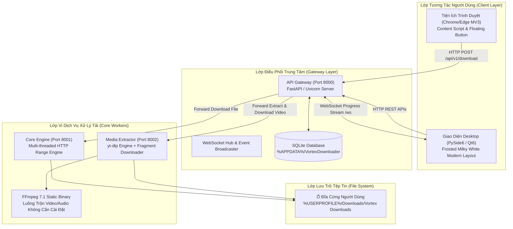

# 🏗️ TÀI LIỆU KIẾN TRÚC KỸ THUẬT VÀ PHÁT TRIỂN (ARCHITECTURE & DEVELOPER GUIDE)

Tài liệu này mô tả chi tiết toàn bộ thiết kế kiến trúc hệ thống, các vi dịch vụ backend, giao thức truyền thông liên tiến trình, cơ sở dữ liệu và quy trình đóng gói của **Vortex Downloader**.

---

## 1. Sơ Đồ Kiến Trúc Tổng Thể (System Architecture)

Vortex Downloader được xây dựng theo mô hình **Vi dịch vụ phi tập trung (Decoupled Microservices)** kết hợp giao diện máy tính **PySide6 (Qt6)** và tiện ích mở rộng trình duyệt **Chromium Manifest V3**.



---

## 2. Chi Tiết Các Phân Hệ (Services Breakdown)

### 2.1 API Gateway (Port 8000)
* **Công nghệ:** Python 3.10+, FastAPI, Uvicorn, SQLite3, WebSocket.
* **Vai trò:**
  * Tiếp nhận mọi yêu cầu tải từ trình duyệt (Extension) và từ cửa sổ Desktop.
  * Phân tích URL: Nếu là link video (YouTube, Facebook, TikTok...) -> định tuyến sang `Media Extractor`. Nếu là file trực tiếp (`.zip`, `.iso`, `.exe`...) -> định tuyến sang `Core Engine`.
  * Quản trị vòng đời tác vụ (Task Lifecycle): Trạng thái, tiến độ, tốc độ, tạm dừng, hủy bỏ.
  * **WebSocket Hub:** Phát sóng luồng dữ liệu tiến trình thời gian thực (`/ws`) đến Desktop GUI với chu kỳ 300ms/lần.
  * Lưu trữ bền vững lịch sử tải xuống vào SQLite database.

### 2.2 Core Engine (Port 8001)
* **Công nghệ:** FastAPI, `httpx`, `aiofiles`, cơ chế HTTP Range Header.
* **Thuật toán tải chia mảnh (Chunk Partitioning):**
  1. Gửi request `HEAD` hoặc `GET (Range: bytes=0-0)` để kiểm tra máy chủ có hỗ trợ tải đa luồng (`Accept-Ranges: bytes`) và lấy tổng dung lượng `Content-Length`.
  2. Chia tổng số byte làm $N$ phần bằng nhau ($N = 8 \dots 32$ luồng).
  3. Mỗi luồng tải độc lập ghi dữ liệu tạm vào các file chunk: `filename.part0`, `filename.part1`,...
  4. Hỗ trợ Resume tự động: đọc kích thước hiện tại của từng chunk trên đĩa để tiếp tục tải từ byte bị gián đoạn.
  5. Khi toàn bộ chunk hoàn thành, kích hoạt stream nối file tuần tự để tạo file hoàn chỉnh và xóa file tạm.

### 2.3 Media Extractor (Port 8002)
* **Công nghệ:** `yt-dlp` lõi mới nhất, FFmpeg 7.1 tĩnh, `asyncio`.
* **Cơ chế bóc tách & tải đa phân đoạn:**
  * Sử dụng thư viện `yt-dlp` trích xuất thông tin định dạng, codec, độ phân giải và dung lượng ước tính.
  * Tải đồng thời cả luồng video cao nhất (chỉ có hình) và luồng audio tốt nhất (chỉ có tiếng) bằng 16 phân đoạn song song (`concurrent_fragment_downloads = 16`).
  * Gọi trực tiếp binary `ffmpeg.exe` tĩnh nhúng kèm trong ứng dụng để merge 2 luồng lại thành 1 file MP4 hoặc MP3 duy nhất.

### 2.4 Desktop GUI (PySide6 / Qt6)
* **Phong cách giao diện:** Frosted Milky White (`#f8fafc`), thiết kế hiện đại lấy cảm hứng từ Linear và Raycast.
* **Cấu trúc thành phần:**
  * **Thanh Sidebar (240px):** Logo, nút CTA lớn `＋ Thêm liên kết mới`, bộ lọc danh mục kèm số đếm động, phím tắt tiện ích và huy hiệu trạng thái kết nối Gateway.
  * **Vùng nội dung chính (Right):** Thanh tìm kiếm tức thời (Live Search), huy hiệu đo tổng tốc độ mạng (MB/s), bảng tác vụ phân tách rõ ràng không đường viền thô, pill tag trạng thái bo tròn và các nút thao tác nhanh trên dòng.
  * **Hộp thoại thêm tải (AddDownloadDialog):** Tích hợp phân tích link video, tự động mapping danh sách preset độ phân giải và tùy chọn số luồng tải.
  * **Khay hệ thống (System Tray):** Cho phép ứng dụng thu nhỏ chạy ngầm khi Windows khởi động hoặc khi bấm tắt cửa sổ chính.

### 2.5 Tiện Ích Trình Duyệt (Chrome / Edge Extension MV3)
* **Công nghệ:** JavaScript ES6, CSS3, Chrome Extensions Manifest V3.
* **Hoạt động:**
  * Tự động inject nút tải nổi gradient `⚡ Tải Video` trực tiếp lên góc trên trình phát video của YouTube, Facebook, TikTok.
  * Bắt sự kiện click để hiển thị dropdown menu chọn độ phân giải (8K, 4K, 1080p, MP3...).
  * Gửi lệnh trực tiếp về Gateway cục bộ `http://127.0.0.1:8000/api/v1/download` hoặc kích hoạt mở hộp thoại Desktop GUI.

---

## 3. Quản Lý Dữ Liệu & Phân Quyền Windows

Để đảm bảo ứng dụng không bao giờ bị lỗi từ chối quyền truy cập (`PermissionError: [WinError 5] Access is denied`) khi người dùng cài vào `C:\Program Files (x86)\`:

1. **Cơ sở dữ liệu SQLite & Cookies:**
   * Được tự động chuyển vào thư mục dữ liệu cá nhân của người dùng:
     ```
     %APPDATA%\VortexDownloader\data\vortex_history.db
     %APPDATA%\VortexDownloader\data\cookies.txt
     ```
2. **Thư mục tải mặc định (Default Download Dir):**
   * Được trỏ tự động về thư mục Downloads của người dùng:
     ```
     %USERPROFILE%\Downloads\Vortex Downloads
     ```
3. **Cơ chế Khởi động cùng Windows (Registry Run Key):**
   * Sử dụng khóa registry ở cấp độ người dùng hiện tại (Current User), không yêu cầu quyền Admin:
     ```
     HKCU\Software\Microsoft\Windows\CurrentVersion\Run\VortexDownloader = "...\VortexDownloader.exe" --minimized
     ```

---

## 4. Hướng Dẫn Phát Triển & Đóng Gói (Build & Packaging)

### 4.1 Chạy thử nghiệm trong môi trường phát triển (Dev Mode)
Yêu cầu: Python 3.10+ đã cài đặt.

```powershell
# 1. Kích hoạt môi trường ảo
.\.venv\Scripts\Activate.ps1

# 2. Cài đặt thư viện phụ thuộc
pip install -r requirements.txt

# 3. Khởi chạy toàn bộ hệ thống (3 dịch vụ backend + Desktop GUI)
python run_app.py
```

---

### 4.2 Tự động đóng gói bộ cài đặt Setup Wizard 1-Click
Hệ thống tích hợp script đóng gói tự động [build_installer.py](file:///d:/Adjim%20Personal/vortex-downloader/build_installer.py) kết hợp giữa **PyInstaller** và **Inno Setup 6**:

```powershell
python build_installer.py
```

**Các bước script tự động thực hiện:**
1. Tạo icon chuẩn Windows `.ico` từ file PNG chất lượng cao.
2. Chạy **PyInstaller** với cấu hình tối ưu trong [vortex.spec](file:///d:/Adjim%20Personal/vortex-downloader/vortex.spec) để đóng gói toàn bộ Python, PySide6, FFmpeg tĩnh và Extension vào thư mục `dist\VortexDownloader\`.
3. Tự động tìm kiếm trình biên dịch **Inno Setup 6** (`ISCC.exe`).
4. Biên dịch kịch bản [installer/vortex_setup.iss](file:///d:/Adjim%20Personal/vortex-downloader/installer/vortex_setup.iss) thành file cài đặt độc lập:
   ```
   installer_output\Vortex_Downloader_Setup.exe (~144 MB)
   ```

---

## 5. Danh Mục Mã Nguồn

```
vortex-downloader/
├── client/
│   └── desktop_gui/             # Giao diện PySide6 (Desktop GUI)
│       ├── assets/              # Icons, checkmarks, logo
│       ├── add_dialog.py        # Hộp thoại thêm liên kết tải
│       ├── loading_overlay.py   # Lớp phủ loading mượt mà
│       ├── main_window.py       # Cửa sổ chính hiện đại
│       ├── styles.py            # Hệ thống design system QSS
│       └── websocket_worker.py  # Luồng nhận dữ liệu WebSocket
├── common/
│   ├── database.py              # SQLite storage & appdata path
│   ├── schemas.py               # Pydantic schemas chung
│   └── utils.py                 # Tiện ích URL, registry, format bytes
├── extension/                   # Tiện ích mở rộng Chrome/Edge (MV3)
│   ├── manifest.json            # Cấu hình Extension Manifest V3
│   ├── content.js               # Script tiêm nút tải trên YouTube/TikTok
│   └── background.js            # Background service worker
├── services/
│   ├── core_engine/             # Dịch vụ tải file Range đa luồng (:8001)
│   ├── gateway/                 # API Gateway trung tâm (:8000)
│   └── media_extractor/         # Dịch vụ bóc tách media yt-dlp (:8002)
├── installer/
│   └── vortex_setup.iss         # Kịch bản Inno Setup Compiler 6
├── build_installer.py           # Script tự động hóa đóng gói 1-click
├── vortex.spec                  # Cấu hình PyInstaller
├── run_app.py                   # Điểm khởi chạy chính toàn bộ app
├── requirements.txt             # Danh sách thư viện Python
├── README.md                    # Giới thiệu tổng quan dự án
├── USER_GUIDE.md                # Sách hướng dẫn sử dụng chi tiết
└── ARCHITECTURE.md              # Tài liệu kiến trúc kỹ thuật
```
