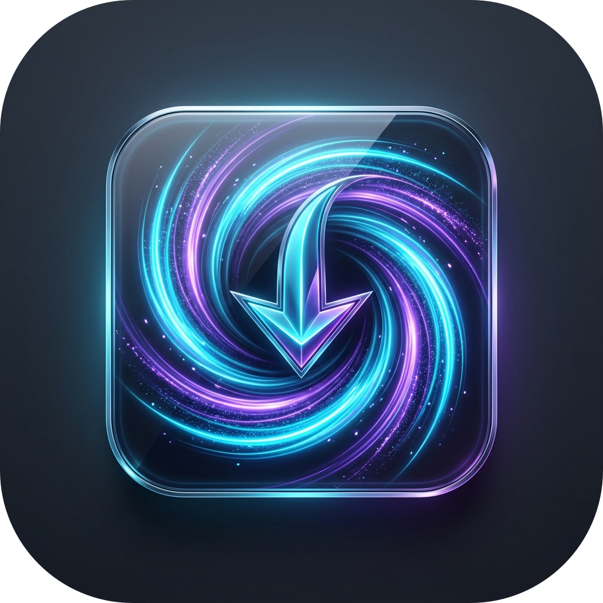
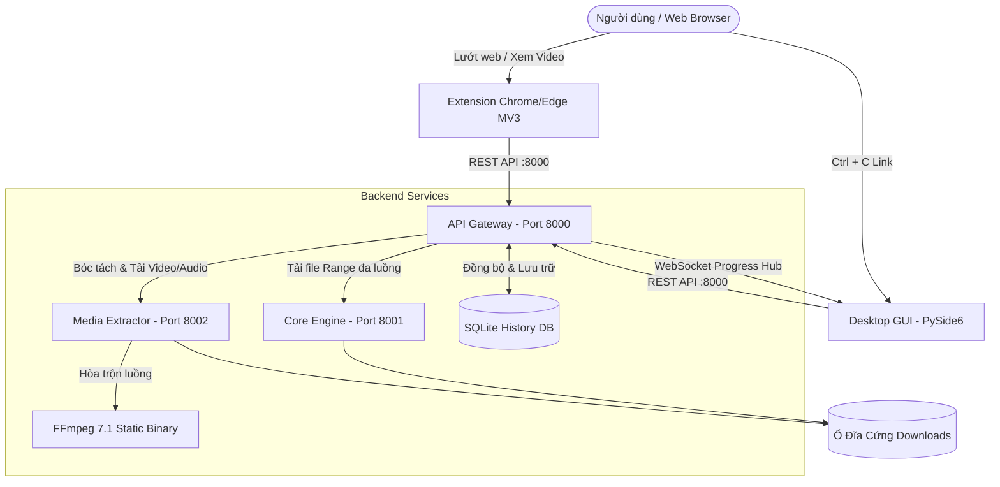

<div align="center">

# ⚡ VORTEX DOWNLOADER
### **Trình Tải Video & Tệp Tin Đa Luồng Thế Hệ Mới (Kiến Trúc Microservices)**

<p align="center">
  
</p>

[](https://www.python.org/)
[](https://fastapi.tiangolo.com/)
[](https://pypi.org/project/PySide6/)
[](https://github.com/yt-dlp/yt-dlp)
[](https://ffmpeg.org/)
[](https://developer.chrome.com/docs/extensions/mv3/)
[](LICENSE)

<p align="center">
  <b>Tăng tốc tải dữ liệu tối đa băng thông • Tách video 4K/2K/1080p/MP3 thông minh • Tiện ích nhúng Chrome/Edge • Giao diện Desktop Dark Mode</b>
</p>

---

</div>

## 🌟 Điểm Nhấn Công Nghệ Vượt Trội

* 🚀 **Tải đa luồng chuẩn IDM (Multi-threaded Range Engine):** Tự động chia nhỏ tệp tin thành **8 đến 32 phần song song** thông qua HTTP Range header, tối đa hóa 100% băng thông đường truyền internet.
* 🎬 **Trích xuất video thông minh (Media Extractor):** Hỗ trợ YouTube, Facebook, TikTok, Instagram và các luồng HLS/m3u8. Tự động bóc tách từ **4K UHD (2160p), 2K QHD (1440p), Full HD (1080p), 720p, 480p** đến **Chỉ tải MP3**.
* 🧩 **Tích hợp FFmpeg 7.1 tĩnh độc lập:** Tự động hòa trộn luồng hình ảnh độ nét cao và âm thanh tốt nhất mà không yêu cầu người dùng phải tự cài đặt FFmpeg trên Windows.
* 🌐 **Tiện ích trình duyệt thế hệ mới (Manifest V3 Extension):** Nút tải nổi gradient trực tiếp trên trình phát video, menu dropdown chống rớt hover, hiển thị ước tính dung lượng tệp (~MB) và nút tắt `✕` linh hoạt.
* 🎨 **Giao diện Desktop hiện đại (PySide6 Dark Mode):** Thiết kế phong cách Cyberpunk / Catppuccin, cập nhật tiến trình thời gian thực qua **WebSocket**, hỗ trợ thu nhỏ xuống Khay hệ thống (System Tray).
* 📋 **Tự động bắt link Clipboard (Clipboard Monitor):** Nhận diện ngay lập tức khi bạn bấm `Ctrl + C` bất kỳ đường dẫn tải nào khi lướt web.
* 💾 **Lưu trữ lịch sử bền vững (SQLite DB):** Toàn bộ tác vụ tải, trạng thái, đường dẫn tệp và kích thước tệp thật được lưu trữ vĩnh viễn trong cơ sở dữ liệu SQLite cục bộ.

---

## 🏗️ Kiến Trúc Hệ Thống (Microservices Architecture)



### Chi tiết các dịch vụ:
| Dịch vụ | Cổng (Port) | Công nghệ | Nhiệm vụ chính |
| :--- | :---: | :---: | :--- |
| **API Gateway** | `8000` | FastAPI, Uvicorn, SQLite | Điều phối thông minh, quản trị tác vụ, WebSocket Hub tập trung |
| **Core Engine** | `8001` | FastAPI, aiohttp, HTTP Range | Tải tệp tin trực tiếp đa luồng, ghép nối chunk tự động, Pause/Resume |
| **Media Extractor**| `8002` | yt-dlp, FFmpeg 7.1, asyncio | Bóc tách metadata, tải đa phân đoạn (16 fragments), chuyển đổi sang MP4/MP3 |
| **Desktop Client** | Desktop | PySide6, Qt6, Dark Theme | Bảng điều khiển tác vụ, lọc trạng thái, menu ngữ cảnh chuột phải, System Tray |
| **Browser Extension**| Chrome/Edge | Vanilla JS, CSS3, Manifest V3 | Nút tải nổi trên trình duyệt, tự động dò phân giải, click-to-toggle menu |

---

## 📸 Giao Diện Trực Quan

### 1. Nút Tải Nổi Thông Minh Trên Trình Duyệt
* Tích hợp trực tiếp trên khung phát video YouTube / Facebook / Web phim.
* Menu xổ xuống với các mức chất lượng và dung lượng ước tính (~MB, ~GB).
* Nút tắt `✕` để ẩn thanh tải cho video hiện tại khi không muốn bị vướng mắt.

### 2. Giao Diện Desktop Điều Khiển Tập Trung
* Bộ lọc trạng thái: `Tất cả`, `Đang tải`, `Hoàn tất`, `Tạm dừng`.
* Menu chuột phải: `Tạm dừng`, `Tiếp tục`, `Mở thư mục chứa file`, `Xóa khỏi lịch sử`.
* Cột tiến độ thời gian thực: Tốc độ tải (MB/s), phần trăm hoàn thành, dung lượng thực tế, thời gian còn lại (ETA).

---

## ⚡ Hướng Dẫn Cài Đặt & Khởi Chạy

### 1. Yêu cầu hệ thống
* **Hệ điều hành:** Windows 10/11 (hoặc Linux / macOS).
* **Python:** Phiên bản `3.10` trở lên.
* **Trình duyệt:** Google Chrome, Microsoft Edge, Cốc Cốc, Brave hoặc bất kỳ trình duyệt nhân Chromium nào.

### 2. Cài đặt môi trường
Mở PowerShell hoặc Terminal tại thư mục dự án:
```powershell
# Tạo môi trường ảo Python
python -m venv .venv

# Kích hoạt môi trường ảo (Windows PowerShell)
.\.venv\Scripts\Activate.ps1

# Cài đặt toàn bộ thư viện cần thiết
pip install -r requirements.txt
```

### 3. Khởi chạy 1-Click (Khuyến nghị)
Chỉ cần chạy lệnh duy nhất sau, ứng dụng sẽ tự động kích hoạt cả 3 Microservices và mở ngay giao diện Desktop:
```powershell
python run_app.py
```
> Khi tắt cửa sổ giao diện, script sẽ tự động dọn dẹp và đóng an toàn tất cả các tiến trình dịch vụ phía sau.

---

## 🧩 Cài Đặt Extension Vào Trình Duyệt (Chrome / Edge)

1. Mở trình duyệt và truy cập vào trang quản lý tiện ích:
   * **Google Chrome:** `chrome://extensions`
   * **Microsoft Edge:** `edge://extensions`
2. Bật chế độ **Nhà phát triển (Developer Mode)** ở góc trên bên phải.
3. Bấm vào nút **Tải tiện ích đã giải nén (Load unpacked)**.
4. Chọn thư mục `extension` trong thư mục dự án `vortex-downloader`.
5. Truy cập bất kỳ video nào trên **YouTube** để thấy thanh tải nổi Vortex xuất hiện ngay trên video!

---

## 📡 Tài Liệu API & WebSocket

Khi hệ thống khởi chạy, bạn có thể xem tài liệu tương tác Swagger UI tại:
* **API Gateway Documentation:** [http://localhost:8000/docs](http://localhost:8000/docs)
* **Core Engine Documentation:** [http://localhost:8001/docs](http://localhost:8001/docs)
* **Media Extractor Documentation:** [http://localhost:8002/docs](http://localhost:8002/docs)

### Các Endpoint Tiêu Biểu:
* `POST /api/v1/download`: Khởi tạo tác vụ tải mới (hệ thống tự động định tuyến đến Core Engine hoặc Media Extractor).
* `POST /api/v1/extract`: Trích xuất thông tin độ phân giải, định dạng và dung lượng video.
* `GET /api/v1/tasks`: Lấy danh sách toàn bộ tác vụ trong lịch sử SQLite.
* `POST /api/v1/tasks/{id}/pause`: Tạm dừng tác vụ tải.
* `POST /api/v1/tasks/{id}/resume`: Tiếp tục tác vụ tải.
* `POST /api/v1/tasks/{id}/cancel`: Xóa hoàn toàn tác vụ khỏi bộ nhớ và SQLite.
* `WS /ws/progress`: Kênh WebSocket phát sóng tiến độ theo thời gian thực (500ms heartbeat).

---

## 📁 Cấu Trúc Mã Nguồn

```text
vortex-downloader/
├── client/                     # Mã nguồn máy khách
│   └── desktop_gui/            # Giao diện Desktop PySide6
│       ├── assets/             # Biểu tượng 3D squircle cao cấp
│       ├── add_dialog.py       # Cửa sổ thêm link tải thủ công
│       ├── main_window.py      # Cửa sổ chính & khay hệ thống
│       ├── styles.py           # Bảng phong cách Dark Theme QSS
│       └── websocket_worker.py # Luồng nền lắng nghe WebSocket
├── common/                     # Thư viện dùng chung giữa các dịch vụ
│   ├── database.py             # Quản lý cơ sở dữ liệu SQLite bền vững
│   └── schemas.py              # Mô hình dữ liệu chuẩn Pydantic
├── extension/                  # Tiện ích mở rộng trình duyệt (MV3)
│   ├── background/             # Service worker nền
│   ├── content/                # Thanh tải nổi & cầu nối tương tác video
│   ├── icons/                  # Bộ biểu tượng đa kích thước (16-128px)
│   ├── popup/                  # Giao diện popup kiểm tra trạng thái
│   └── manifest.json           # Tệp cấu hình Chrome Manifest V3
├── services/                   # Các dịch vụ Microservices độc lập
│   ├── core_engine/            # Cổng 8001: Bộ tải tệp tin HTTP Range đa luồng
│   ├── media_extractor/        # Cổng 8002: Bộ bóc tách và ghép video yt-dlp + FFmpeg
│   └── gateway/                # Cổng 8000: API Gateway điều phối & WebSocket Hub
├── .gitignore                  # Cấu hình bỏ qua tệp nhị phân và cache
├── requirements.txt            # Danh sách gói phụ thuộc Python
├── run_app.py                  # Trình khởi động 1-Click toàn bộ hệ thống
└── README.md                   # Tài liệu hướng dẫn sử dụng chính thức
```

---

## 🤝 Đóng Góp Phát Triển (Contributing)

Mọi đóng góp nhằm cải thiện tính năng, sửa lỗi hoặc tối ưu hóa hiệu năng đều được chào đón nồng nhiệt!
1. **Fork** dự án về tài khoản GitHub của bạn.
2. Tạo nhánh tính năng mới (`git checkout -b feature/TinhNangMoi`).
3. Commit các thay đổi (`git commit -m 'Thêm tính năng mới'`).
4. Push lên nhánh của bạn (`git push origin feature/TinhNangMoi`).
5. Mở một **Pull Request** trên GitHub.

---

## 📄 Bản Quyền (License)

Dự án được phát hành theo giấy phép mã nguồn mở [MIT License](LICENSE). Tự do sử dụng, chỉnh sửa và phân phối cho mục đích cá nhân cũng như thương mại.

<div align="center">
  <b>Phát triển với ❤️ bởi <a href="https://github.com/chuantranvn">chuantranvn</a></b>
</div>
